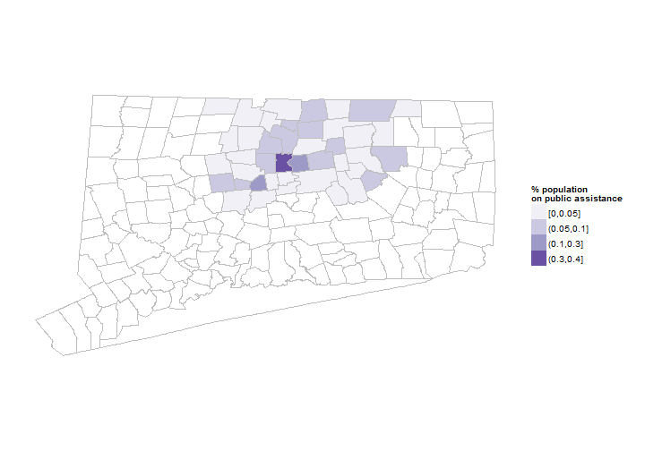
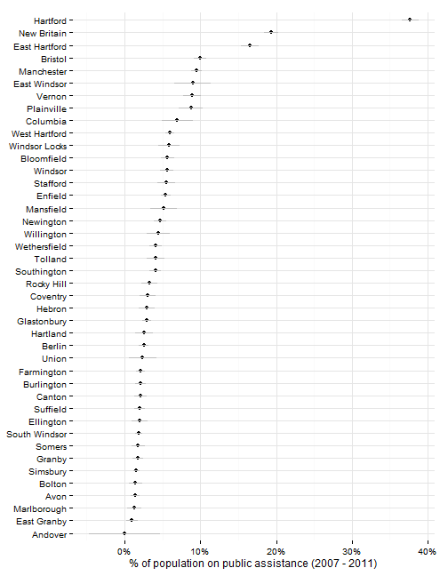
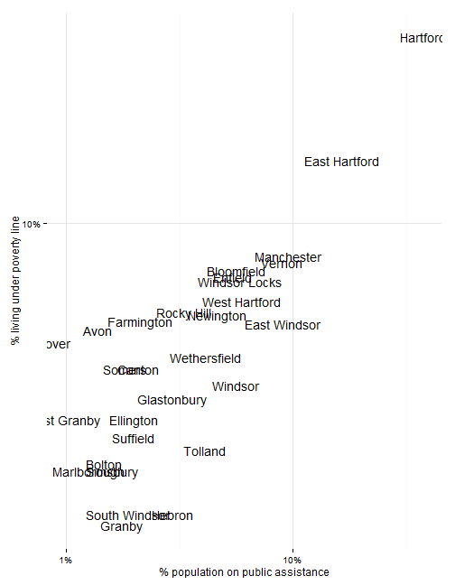
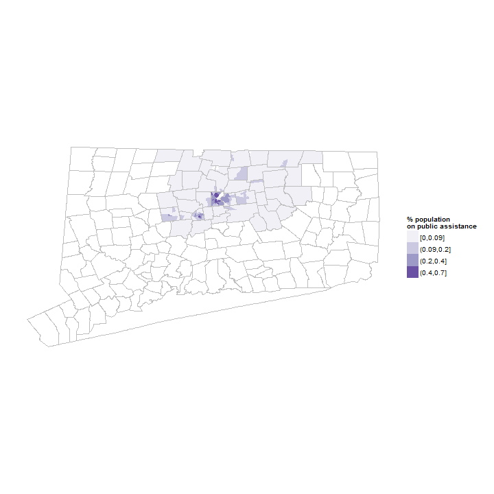
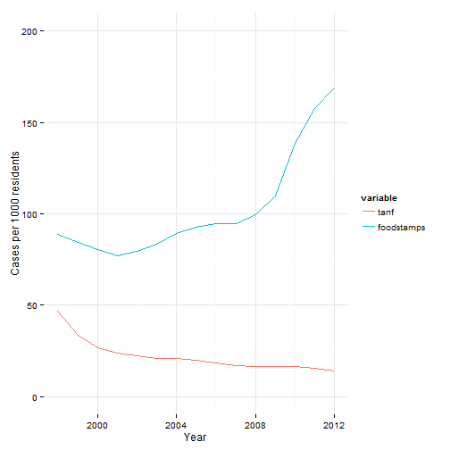
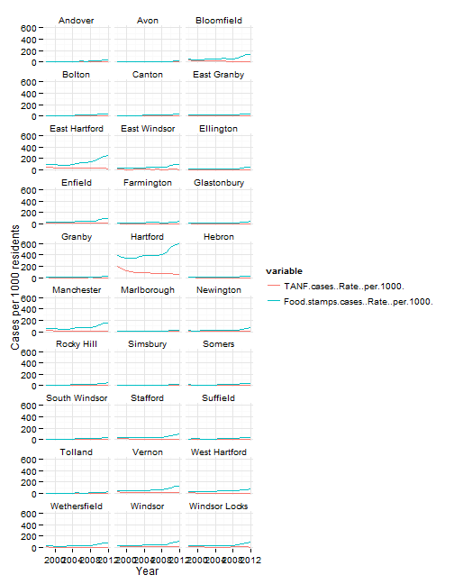

## Public assistance indicators

This page covers indicators related to whether Hartford area residents receive public assistance through various programs. 

## Data and limitations

Data on public assistance programs is available nationally through the Census Bureau, primarily the American Community Survey, and within Connecticut from the Department of Social Services. 

## What do we already know?

Indicators of cases and recipients of public assistance are used in a few reports. 

### Local

* [CT Fair Housing Center Opportunity Mapping](http://www.ctfairhousing.org/people-place-and-opportunity-report/) (developed with the Kirwan Institute at Ohio State) includes the population on public assistance as a factor in their opportunity index, using Census data.
* [Population Results Working Group](http://www.ct.gov/opm/cwp/view.asp?a=2998&Q=490946) includes the percent of all households receiving SNAP (Supplemental Nutrition Assistance Program) using data from DSS.

### Other relevant efforts

* [What Matters to Metros](http://www.futurefundneo.org/whatmatters) includes data on the percentage of households receiving SSI, cash assistance, and food stamps, via Census data.

## Sample results

The census asks about [usage of public assistance](http://factfinder2.census.gov/faces/tableservices/jsf/pages/productview.xhtml?pid=ACS_11_5YR_B19058&prodType=table), defined as foot stamps or SNAP. 

The sample results below are for all towns in Hartford and Tolland Counties for convenience. 

 

Since the data is drawn from the ACS, there are margins of error associated with the values, which can be large for small towns. 

Hartford has about twice the population on public assistance of the next highest town in the region, which itself has almost twice as high a rate as the next town. 

 

The rates of public assistance usage track closely to poverty levels. The chart below compares poverty levels to usage of public assistance rates (on a log scale, to accomodate the large gaps between towns). 

 

The census data on public assistance can also be looked at by neighborhood (for 5-year estimates). Neighborhood maps for the region confirm the high concentration of recipients of public assistance in Hartford. 

 

DSS releases data on cases and recipients for HUSKY, Medicaid, TANF and foot stamps, published via the [CTData portal](http://ctdata.org/catalog).

Aggregate data for the region shows increases in food stamps usage from 2008 to the present.

 

Looking at data by town shows that most of the increases have come through Hartford, although with higher numbers of cases also many other towns - East Hartford, Bloomfield and Manchester especially. 

 

